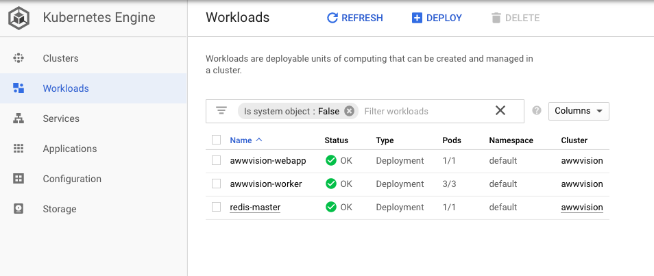

# Awwvision Cloud Vision API from a Kubernetes Cluster
> https://github.com/GoogleCloudPlatform/cloud-vision/tree/master/python/awwvision

## Keyword

## Summary
- Reddit으로부터 이미지를 가져와서 분류하고 label을 붙이는 예제
- `Redis` instance, web app, `Pub/sub` 사용

~~~bash
# awwvision 클러스터 생성 with --scopes option
gcloud config set compute/zone us-central1-f
gcloud container clusters create awwvision \
    --num-nodes 2 \
    --scopes cloud-platform
gcloud container clusters get-credentials awwvision
kubectl cluster-info

# 샘플 설치 후 kubectl get svc의 external ip로 접속하여 확인
git clone https://github.com/GoogleCloudPlatform/cloud-vision
cd cloud-vision/python/awwvision
make all
kubectl get pods
kubectl get deployments -o wide
kubectl get svc awwvision-webapp
~~~

## Comment
- `gcloud container clusters create`의 `--scope` 옵션?
- make를 굳이 사용한 이유는?
- awwvision을 설치하고 동작하는 것 정보만 봤는데 redis나 pub/sub이 어떻게 사용되었는지, 이미지 분류가 어떻게 구현되었는지는 github 소스를 봐야할 것 같다.
